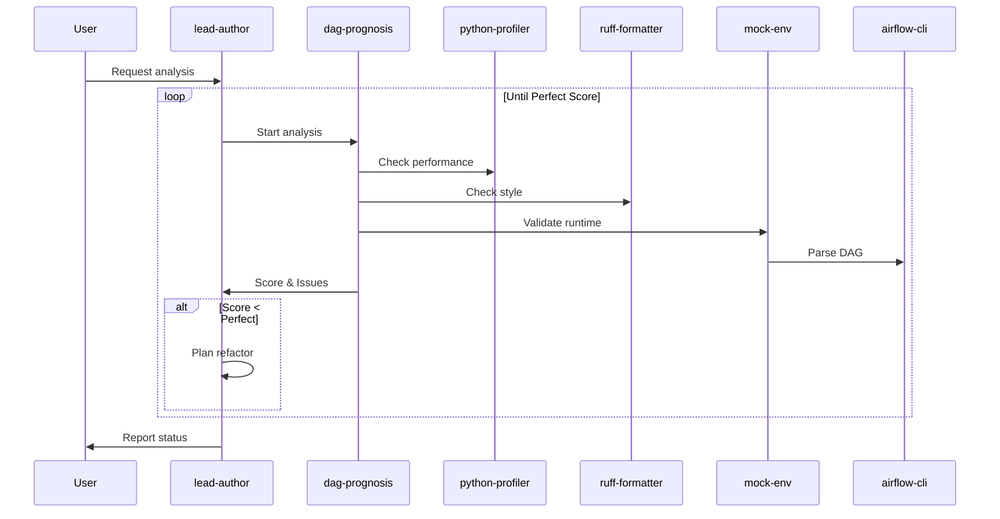
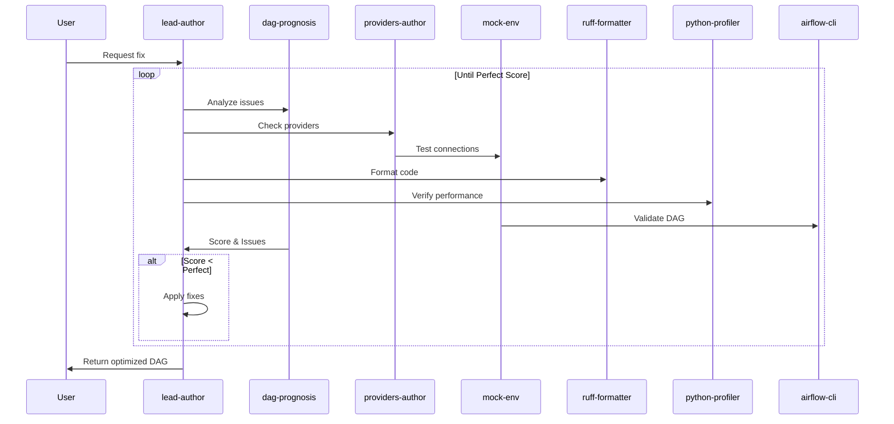
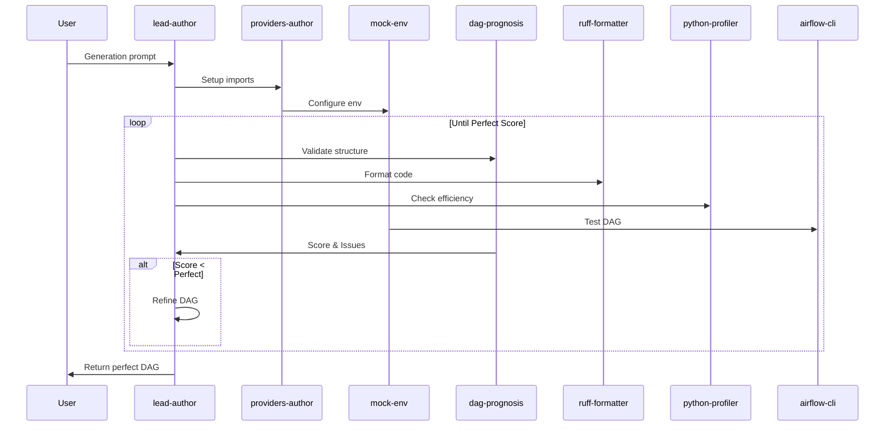

# DAG Assistant

AI-powered Apache Airflow DAG assistant that analyzes, fixes, and generates DAGs using best practices.

## Features

- DAG Analysis with iterative optimization
- Automated fixes with version control
- Natural language DAG generation
- Multi-agent architecture for specialized tasks
- Runtime validation in isolated environments

## Workflow

### 1. Analyze DAG

### 2. Fix DAG

### 3. Generate DAG

## Agents

- **dag-prognosis**
- **lead-author**
- **airflow-cli**
- **providers-author**
- **ruff-formatter**
- **python-profiler**
- **mock-env**
