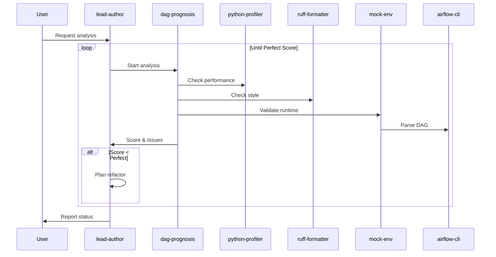
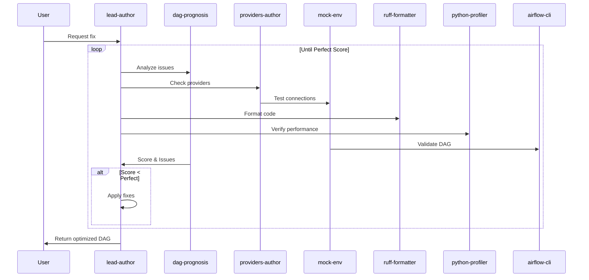
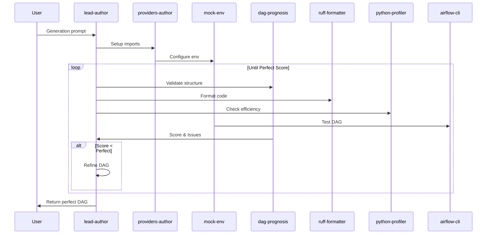

# CrewAI Design

## Agents

1. **dag-prognosis**
   - Static analysis
   - Pattern detection
   - Performance metrics
   - Version compatibility checks

2. **lead-author**
   - Code generation
   - Code review
   - Task orchestration
   - Version management

3. **airflow-cli**
   - DAG parsing
   - Task testing
   - Deployment
   - CLI operations

4. **providers-author**
   - Provider compatibility
   - Import management
   - Connection setup
   - Provider-specific patterns

5. **ruff-formatter**
   - Code formatting
   - Import sorting
   - Style enforcement
   - PEP compliance

6. **python-profiler**
   - Runtime analysis
   - Memory profiling
   - Performance bottlenecks
   - Optimization suggestions

7. **mock-env**
   - Test environment
   - Connection mocking
   - Variable simulation
   - Runtime validation

## Tools

1. **Static Analysis**
   - AST parsing
   - Pattern matching
   - Import analysis
   - Version checking

2. **Runtime Tools**
   - Docker environments
   - Airflow API
   - Python debugger
   - Memory profiler

3. **Code Tools**
   - Git operations
   - Code formatters
   - Linters
   - AST transformers

4. **Testing Tools**
   - Unit test runners
   - Integration tests
   - Mock generators
   - Validation scripts

## Processes

### 1. Analyze DAG

### 2. Fix DAG

### 3. Generate DAG

## Tasks

1. **Analysis Tasks**
   - Code quality check
   - Performance analysis
   - Style validation
   - Runtime verification

2. **Fix Tasks**
   - Issue resolution
   - Code reformatting
   - Provider updates
   - Version compatibility

3. **Generation Tasks**
   - Scaffold creation
   - Provider setup
   - Task definition
   - Dependency mapping
 