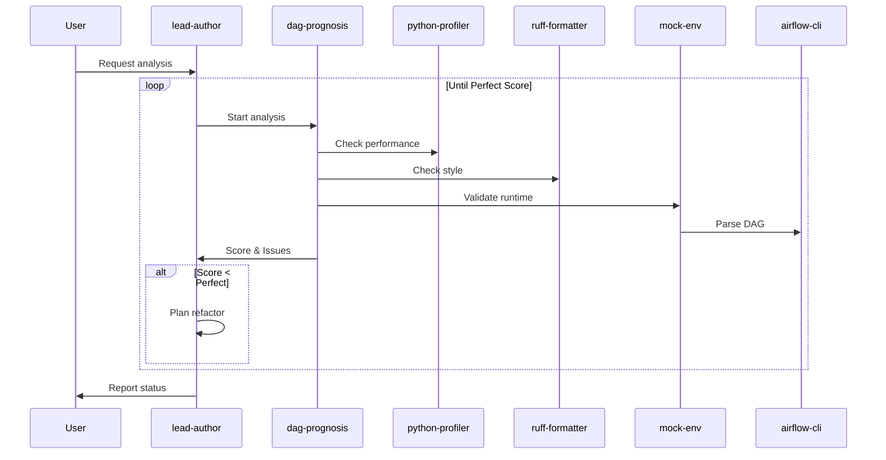
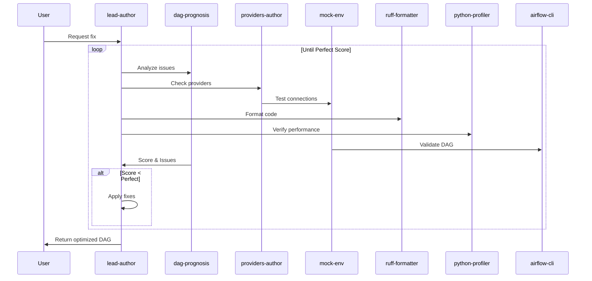
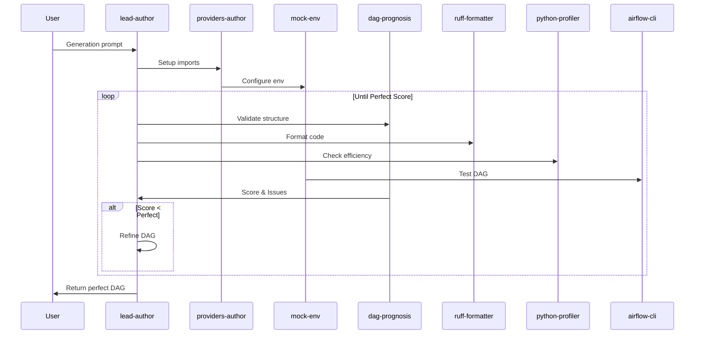

# CrewAI Code Design

## Architecture Overview

The Airflow Crew is implemented as an event-driven Flow using CrewAI's Flow system, following the original design's iterative improvement approach.

## Core Components

### Base Structure
```python
@CrewBase
class AirflowCrew(Flow):
    def __init__(self):
        super().__init__()
        self.code_llm = LLM(model="qwen/qwen-2.5-coder-32b-instruct", temperature=0.01)
        self.general_llm = LLM(model="qwen/qwq-32b-preview", temperature=0.01)
```

### LLM Configuration
- **Code-focused LLM**: `qwen/qwen-2.5-coder-32b-instruct` for precise code generation
- **General LLM**: `qwen/qwq-32b-preview` for analysis and planning
- Temperature set to 0.01 for deterministic outputs

## Workflows

### 1. DAG Analysis Workflow


Implementation:
```python
@start()
def analyze_dag(self, dag_path: Path) -> dict:
    # TODO: Implement scoring system
    # TODO: Add loop until perfect score
    crew = Crew(
        agents=[self.dag_prognosis(), self.python_profiler(), self.mock_env()],
        tasks=[
            Task(description="Analyze DAG for issues", agent=self.dag_prognosis()),
            Task(description="Check performance metrics", agent=self.python_profiler()),
            Task(description="Validate runtime environment", agent=self.mock_env())
        ]
    )
    return crew.kickoff()
```

### 2. Fix DAG Workflow


Implementation:
```python
@listen(analyze_dag)
def fix_dag(self, dag_path: Path, analysis_result: dict) -> dict:
    # TODO: Implement scoring system
    # TODO: Add loop until perfect score
    crew = Crew(
        agents=[self.lead_author(), self.providers_author(), self.ruff_formatter()],
        tasks=[
            Task(description="Plan DAG fixes", agent=self.lead_author()),
            Task(description="Apply provider updates", agent=self.providers_author()),
            Task(description="Format and validate code", agent=self.ruff_formatter())
        ]
    )
    return crew.kickoff()
```

### 3. DAG Generation Workflow


Implementation:
```python
@start()
def generate_dag(self, prompt: str) -> dict:
    # TODO: Implement scoring system
    # TODO: Add loop until perfect score
    crew = Crew(
        agents=[self.lead_author(), self.providers_author(), self.dag_prognosis()],
        tasks=[
            Task(description="Generate DAG structure", agent=self.lead_author()),
            Task(description="Setup providers and connections", agent=self.providers_author()),
            Task(description="Validate and optimize", agent=self.dag_prognosis())
        ]
    )
    return crew.kickoff()
```

## TODO Items

1. **Scoring System**
   - Implement DAG quality scoring
   - Define perfect score criteria
   - Add score tracking between iterations

2. **Loop Implementation**
   - Add loop logic in each workflow
   - Implement break conditions
   - Handle iteration state

3. **Tools Integration**
   - Static Analysis: AST parsing, pattern matching
   - Runtime Tools: Docker, Airflow API
   - Code Tools: Git, formatters
   - Testing Tools: Unit tests, mocks

4. **Task Refinement**
   - Add more granular tasks
   - Implement proper task dependencies
   - Add task-specific tools

## Agent Configurations

### Code-Focused Agents
- **lead_author**: Code generation and review
- **ruff_formatter**: Code formatting and style
- **python_profiler**: Performance analysis
- **providers_author**: Provider management

### General Task Agents
- **dag_prognosis**: DAG analysis
- **airflow_cli**: CLI operations
- **mock_env**: Environment management

## State Management
- Flow automatically manages state between workflow steps
- Each step receives results from previous steps via parameters
- No manual state tracking needed
