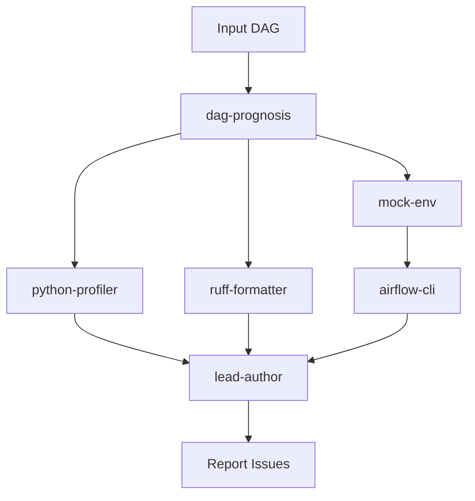
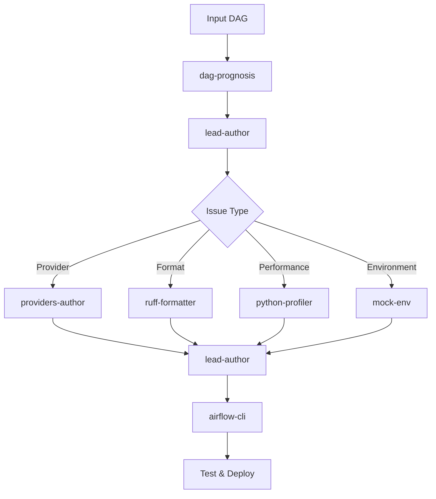
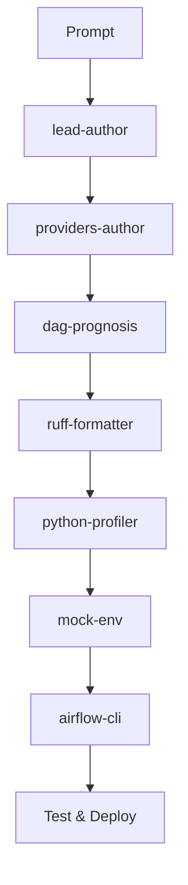

# Grapher: DAG Analysis and Generation Tool

## Core Components

### 1. CLI Interface
- Input: DAG file path or generation prompt
- Commands:
  - `analyze`: Static analysis of existing DAG
  - `fix`: Auto-fix with git version control
  - `generate`: Create new DAG from prompt

### 2. Analysis Engine
- Static Analysis:
  - Import analysis (stdlib, providers, third-party)
  - Task dependency patterns
  - Task complexity metrics
  - Top-level code issues
  - Database access patterns
  - Provider compatibility

- Version-specific Checks:
  - Deprecated features
  - Breaking changes
  - API compatibility

### 3. LLM Integration
- Interface:
  - Abstract LLM client class
  - Provider implementations (OpenAI, Anthropic, etc.)
  - Prompt templates for DAG generation/fixes

### 4. Code Generation
- AST-based transformations
- Git integration for version control
- Provider-aware imports
- Task group organization
- Dependency chain validation

## Agent Architecture

### Agents
- `dag-prognosis`: Static analysis, code quality checks, anti-patterns detection
- `lead-author`: Orchestrates DAG creation/modification, delegates to specialized agents
- `airflow-cli`: Handles Airflow CLI interactions, testing, deployment
- `providers-author`: Manages provider-specific code, imports, connections
- `ruff-formatter`: Code formatting, import sorting, PEP compliance
- `python-profiler`: Performance analysis, memory usage, execution paths
- `mock-env`: Manages test Airflow instance, mocks variables/connections/secrets

### Flow Diagrams

1. Analyze Existing DAG:


2. Fix DAG:


3. Generate DAG:


## Implementation Details

### Phase 1: Analysis
1. Port existing analyzers from dag_prognosis:
   - Import analysis
   - Task complexity
   - Dependency patterns
   - Top-level code checks

2. Add version-specific checks:
   - Load version mappings from embedded YAML
   - Check against Airflow version
   - Flag deprecated features

### Phase 2: LLM Integration
1. Abstract LLM interface:
```python
class LLMProvider:
    def generate_dag(self, prompt: str) -> str: pass
    def fix_issues(self, dag_code: str, issues: List[Issue]) -> str: pass
```

### Phase 3: Code Generation
1. Git Integration:
   - Create feature branch
   - Commit changes
   - PR creation option

2. AST Transformations:
   - Provider import optimization
   - Task group restructuring
   - Dependency chain fixes

## Installation
```bash
pip install airflow-grapher
```

## Usage Examples
```bash
# Analyze existing DAG
grapher analyze path/to/dag.py

# Fix issues
grapher fix path/to/dag.py --auto-commit

# Generate new DAG
grapher generate "ETL pipeline for S3 to Redshift"
